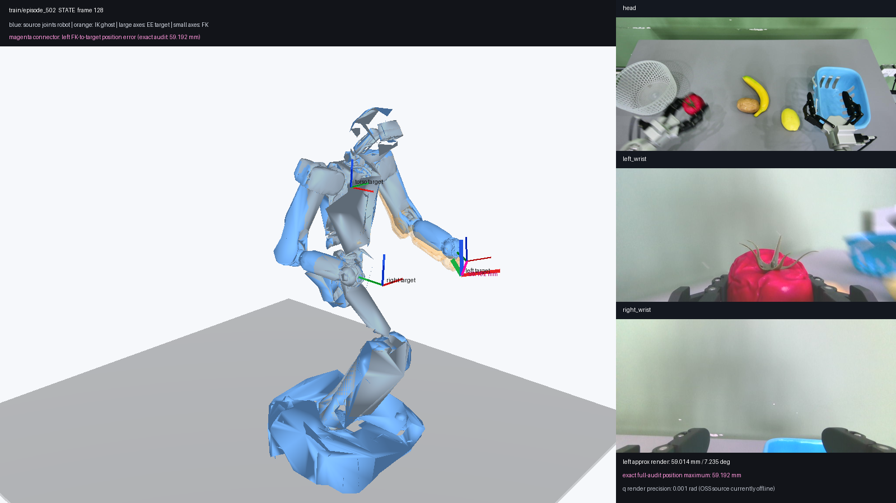

# Astribot EE34 Toolkit

Standalone tools for converting Astribot S1 HDF5 recordings to a frozen
LeRobot EE34 representation, validating the conversion with an independent
URDF forward-kinematics audit, and inspecting the result in Viser.

This repository does **not** depend on OpenPI and does not include OpenPI source
code. It also does not ship datasets, Astribot SDK files, URDF files, or meshes.
The current implementation is intentionally Astribot S1-specific rather than a
generic arbitrary-URDF visualizer.

## What it verifies

```text
source HDF5 poses/joints ── pack ──> LeRobot EE34
          │                              │
          └── joints ── S1 URDF FK ──────┘ position/rotation comparison
                                         └── numerical IK ghost
```

The audit has two independent layers:

1. **Conversion parity:** repack each source HDF5 frame and compare it with the
   parquet EE34 value using `rtol=0, atol=1e-6`.
2. **Kinematics consistency:** compare URDF FK from the recorded joints with the
   torso, left, and right target poses decoded from EE34.

A parity pass means the conversion follows the frozen mapping. An FK pass also
means the joint and pose streams agree under the selected S1 URDF and frame
convention.

## EE34 contract

EE34 stores absolute, chassis-relative values:

| Slice | Meaning |
|---|---|
| `[0:9]` | torso pose: xyz + first two columns of SO(3) |
| `[9:18]` | left end-effector pose |
| `[18]` | left gripper |
| `[19:28]` | right end-effector pose |
| `[28]` | right gripper |
| `[29:31]` | head joints |
| `[31:34]` | chassis x, y, yaw |

`observation.state` comes from `poses_dict` plus
`joints_position_state`; `action` comes from `command_poses_dict` plus
`joints_position_command`. See [the frozen contract](docs/ee34_contract.md) for
the full source mapping.

The model loader validates exactly 20 actuated joints in this order: torso 4,
head 2, left arm 7, right arm 7. It also checks the three end-effector frame
names and referenced mesh files. `astribot_torso.yaml` supplies
`transform.weld_to_base_pose`; the audited S1 configuration contributes a
required `+0.097 m` Z translation. That transform is read from YAML and applied
once rather than being silently replaced with zero.

## Installation

Python 3.11 is recommended. With [uv](https://docs.astral.sh/uv/):

```bash
git clone https://github.com/YOUR_ACCOUNT/astribot-ee34-toolkit.git
cd astribot-ee34-toolkit
uv sync --extra all --group dev
```

The `all` extra installs the LeRobot conversion and Viser dependencies. Smaller
installs are available:

```bash
uv sync --extra lerobot       # conversion and dataset validation
uv sync --extra visualization # FK/IK audit and Viser GUI
```

Configure local paths without editing source code:

```bash
export ASTRIBOT_HDF5_ROOT=/path/to/source-hdf5
export HF_LEROBOT_HOME=/path/to/lerobot-root
export ASTRIBOT_S1_CONFIG_ROOT=/path/to/astribot_s1
export ASTRIBOT_REPORT_DIR=reports
```

`ASTRIBOT_S1_CONFIG_ROOT` must contain:

```text
astribot_s1/
├── astribot_torso.yaml
└── model/
    ├── astribot_whole_body_with_head.urdf
    └── meshes/...
```

The optional contract comparison against Astribot's own rotation utility uses
`ASTRIBOT_EVAL_ROOT`. When unset, that comparison is reported as unavailable.

## Convert and validate

```bash
uv run astribot-ee34-validate-contract
uv run astribot-ee34-convert
uv run astribot-ee34-validate-dataset
uv run astribot-ee34-validate-kinematics --all-frames
```

Every command supports `--help`. The kinematics audit reads only EE34 and index
columns from parquet; it does not decode camera images. Reports are written to
`$ASTRIBOT_REPORT_DIR` and ignored by Git because they may contain private data
paths and can become large.

The kinematics validator exits with:

- `0`: passed, including warning-only results;
- `1`: conversion or kinematics gate failed;
- `2`: invalid input or robot-model configuration.

Default FK warnings start at P95 `5 mm / 1°`. The hard gate fails at P95
`20 mm / 3°`, maximum position error above `50 mm`, or maximum rotation error
above `10°`.

## Viser GUI

Launch the full-mesh view on loopback:

```bash
uv run astribot-ee34-visualize \
  --split validation \
  --episode-id episode_269 \
  --trajectory left \
  --host 127.0.0.1 \
  --port 8080
```

Add `--no-meshes` for lightweight rendering. It uses a blue joint skeleton for
the recorded robot and is much faster through an SSH tunnel. Full mode renders
the recorded robot using the complete blue S1 mesh while retaining the IK ghost
as a lightweight orange/red skeleton, avoiding a second browser copy of all
mesh geometry.

Demo recordings from episode 269 (State, left EE trajectory):

| Full mesh | Simplified (`--no-meshes`) |
|---|---|
| <video src="docs/videos/episode_269_state_full_mesh.mp4" controls width="360"></video> | <video src="docs/videos/episode_269_state_simplified.mp4" controls width="360"></video> |

<details>
<summary>Direct video links</summary>

- [Full mesh](docs/videos/episode_269_state_full_mesh.mp4)
- [Simplified](docs/videos/episode_269_state_simplified.mp4)

</details>

The fixed GUI panel provides split, episode, frame and State/Action controls;
30 Hz playback; camera presets; visibility switches; three synchronized camera
panels; and “Jump to worst frame” when a batch audit report is available.

Scene legend:

- **Blue robot:** source HDF5 joints for the selected State or Action stream.
- **Large EE target axes:** target poses decoded from LeRobot EE34.
- **Small FK axes:** independent S1 URDF FK from the source joints.
- **Orange IK ghost:** all three targets are reachable within `5 mm / 1°`.
  The ghost turns red on an invalid IK result. IK is diagnostic and is not a
  conversion gate.
- **Red line:** one selected EE target history. Choose left, right, torso, or
  none; `--trajectory-frames` controls its tail length.

When target and FK agree, the large and small axes overlap, so three pairs may
look like only three coordinate frames. A wrong mapping or inconsistent stream
separates a pair; in a clear failure you can see up to six axes. Use the numeric
error table for the final judgment rather than visual overlap alone.

The server rejects non-loopback hosts. Forward the port instead of exposing it
publicly:

```bash
ssh -L 8080:127.0.0.1:8080 your-server
```

## Example disagreement



In this captured State frame, the left EE target and left URDF FK are separated
by approximately `59.192 mm` in the full audit; the magenta connector makes the
displacement visible. Torso and right remain close. This is how a localized
joint/pose inconsistency should appear—it should be reported, not hidden by
changing the 0.097 m root weld.

## Development and tests

```bash
uv run ruff check .
uv run pytest -q
```

Pure transform tests run without the proprietary robot model. Model-backed
tests are skipped unless `ASTRIBOT_S1_CONFIG_ROOT` points to a valid S1 model.
With real converted data, a UI smoke test is available:

```bash
uv run astribot-ee34-visualize \
  --split validation --episode-id episode_269 --no-meshes --smoke-test
```

## License and external assets

The toolkit is licensed under Apache-2.0. Astribot SDK and model assets are
distributed separately under their own terms; retain their copyright and
license notices when redistributing them. No Astribot model assets or datasets
are included here.
